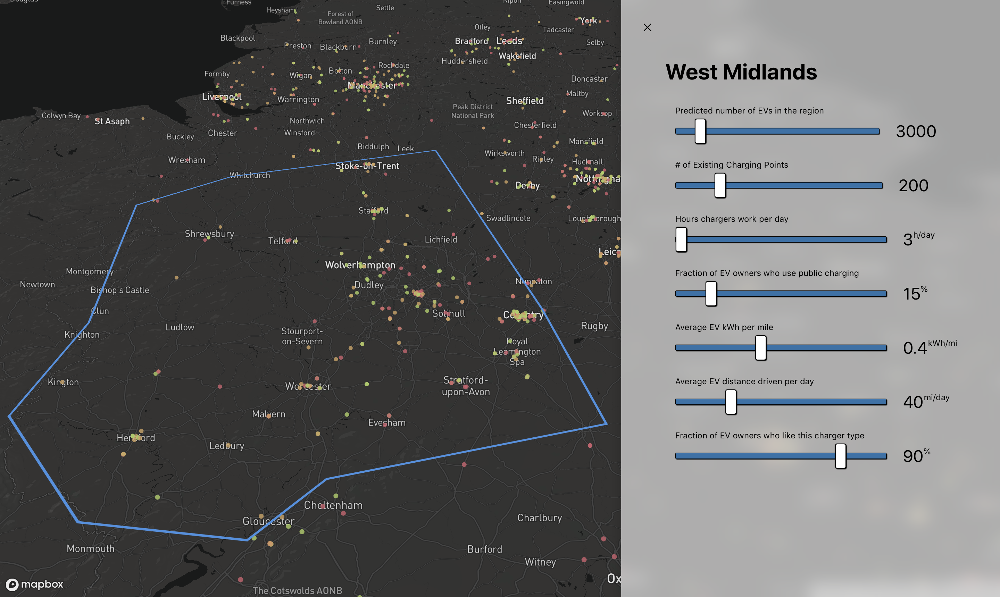
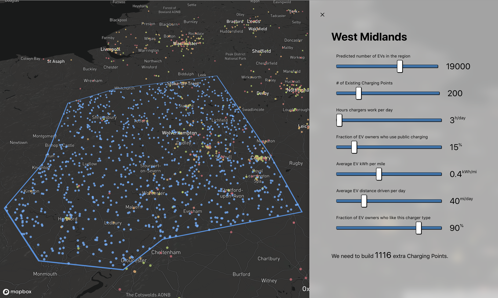
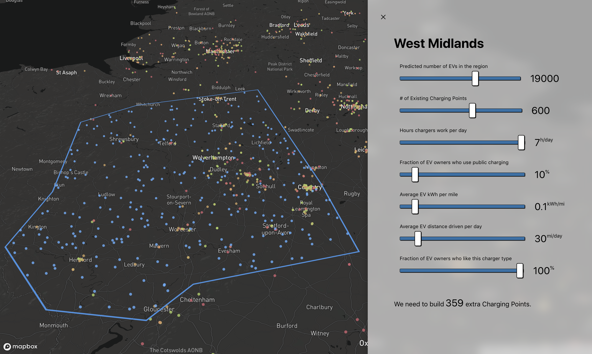

# Charge Predictor

Predicts where to put charging points. Built for the EDF Future Systems Hackathon at Edie Live 2019.

## Running the application

Before continuing, the project requires a Mapbox key, available for free for up to 50k monthly map impressions at https://mapbox.com

Once a key has been acquired, run
```
export REACT_APP_MAPBOX_ACCESS_TOKEN="[MAPBOX_KEY_HERE]"
```

Then, `cd` into the /app directory and run
```
npm install
npm start
```
to start the app.

### The idea

> What will the UK charging network look like in 2025?

At current, approaches to designing new charging networks are a bit hit-and-miss. [Viswathan et al. (2018)](https://link.springer.com/content/pdf/10.1186%2Fs12544-018-0322-8.pdf) conducted a study of the San Diego network, and came to the conclusion that "the current public charging distribution network is neither well designed nor effectively used".

They generated a model for the required number of chargers based on a few factors:

- The number of EVs in an area.
- The daily consumption of EVs in an area.
- The % of EV owners who use public charging (as opposed to charging on their driveway each night).
- The hours per day each charger is working.
- The general efficiency of electric vehicles.

We wanted to get a visualisation of the future of the EV charging network, rather than just a number. So, we combined this calculator with some region-specific data to show how the charger network proliferates as EV numbers grow.

We then place markers on a map (randomly-placed within a bounded region – see _Extensions_), to get a feel for the proliferation of the network. The answer: looking at how the network will proliferate is a good cure for range anxiety!


_The current charging network in the Midlands. Usage is graded as "high use" (red), "mid use" (amber), and "low use" (green). These are randomised!_


_A high-growth network, assuming incentives to drive EV adoption and public charging._


_A low-growth network, assuming limited EV adoption, increased efficiency, lower driving times, and lower public charging engagement._

### Extensions

At current, proposed EV charger placement is randomised. Using some traffic (especially EV traffic) analysis, alongside accurate usage statistics for the existing charging network, we could constrain the placement.

We're making guesses about the numbers of EVs in any given area. Using some more accurate DVLA registry data, we could constrain the proposed charger network to a greater level of precision.

Finally, the parameters to the central model are tuned for a high-density urban area in California. To make the model more accurate, we'd advise getting a small team of scientists to re-run the regressions in Viswathan et al.'s paper, and re-tune the hyperparameters. (We added a `SANITY_FACTOR` to control for this but it can be more accurate).